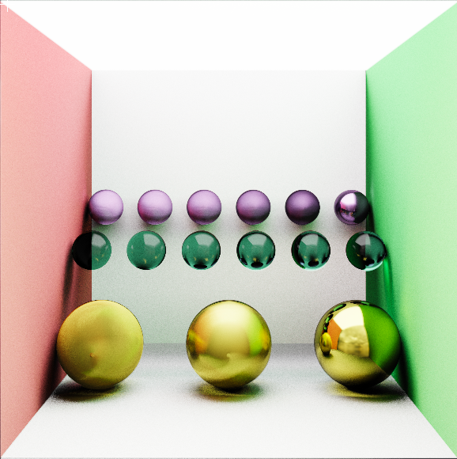

# 初じめまして 👋(,,・ω・,,)

 
 

𝙼𝚢 𝚗𝚊𝚖𝚎 𝚒𝚜 𝙻𝚘ï𝚌

𝙰 𝚙𝚊𝚜𝚜𝚒𝚘𝚗𝚊𝚝𝚎 𝚁𝚎𝚗𝚍𝚎𝚛𝚒𝚗𝚐 𝚊𝚗𝚍 𝙴𝚗𝚐𝚒𝚗𝚎 𝙿𝚛𝚘𝚐𝚛𝚊𝚖𝚖𝚎𝚛 𝚏𝚛𝚘𝚖 𝚃𝚊𝚒𝚠𝚊𝚗 🧋  
𝚆𝚒𝚝𝚑 𝚑𝚊𝚗𝚍𝚜-𝚘𝚗 𝚎𝚡𝚙𝚎𝚛𝚒𝚎𝚗𝚌𝚎 𝚋𝚞𝚒𝚕𝚍𝚒𝚗𝚐 𝚛𝚎𝚗𝚍𝚎𝚛𝚎𝚛𝚜 𝚏𝚛𝚘𝚖 𝚜𝚌𝚛𝚊𝚝𝚌𝚑!  
 
  
 
𝙱𝚎𝚢𝚘𝚗𝚍 𝚝𝚑𝚎 𝚝𝚎𝚌𝚑𝚗𝚒𝚌𝚊𝚕 𝚜𝚒𝚍𝚎, 𝙸 𝚎𝚗𝚓𝚘𝚢 𝚜𝚝𝚞𝚍𝚢𝚒𝚗𝚐 𝚛𝚎𝚊𝚕-𝚝𝚒𝚖𝚎 𝚅𝙵𝚇⚡️ 𝚊𝚗𝚍 𝚙𝚒𝚡𝚎𝚕 𝚊𝚛𝚝👨‍🎨  
 
 

# 𝐒𝐤𝐢𝐥𝐥𝐬✨

